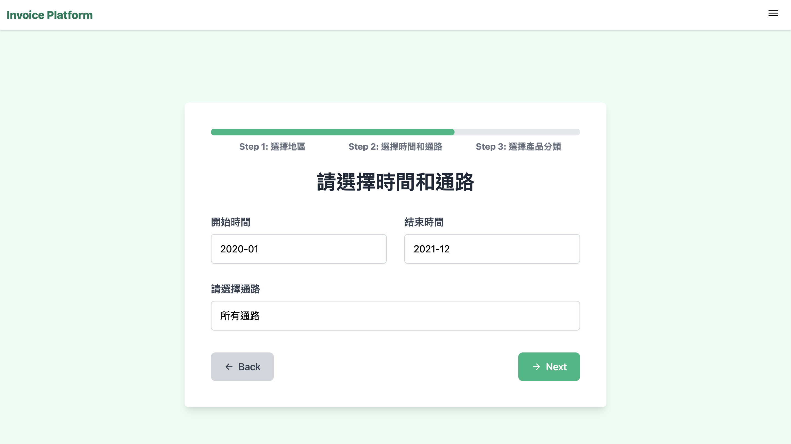

# Invoice

# InVoice – 發票分析應用，將消費數據化繁為簡，為企業打造以數據為導向的未來！

### 1. 專題介紹

「探索消費者行為的全新視角，為行銷策略提供數據驅動的解決方案！」 
我們的專案透過併買網路圖，揭示消費行為模式，助力企業在數位化浪潮中脫穎而出。 
 
以下是我們的核心特色： 
✔️消費者偏好分析：以消費者為核心，透過RFM分群，比較並探索不同消費族群偏好 
✔️產品網路分析：以產品為核心建構網路圖，全面性分析商品併買網路的特性 
✔️商品銷售通路分析：以銷售通路為核心，彙整商品分類在各通路的銷售表現 
✔️LLM語言模型：根據網路圖產生行銷文案與分析報告，生成創意點子的好幫手！ 

### 2. 系統功能

本系統針對兩種使用者（**產品品牌方、銷售通路方**）設計  

**產品品牌方**可以了解「哪間通路銷售狀況較佳、哪些較差」，「在哪些通路可以和其他產品做共同促銷」等營運問題。 

**銷售通路方**可以了解「該通路的產品併買狀況」，「選擇哪些產品可以共同促消」、「了解不同客群的產品併買消費模式」、「競爭者的銷售狀況」等營運問題。 

藉由我們的系統，可以幫助產品品牌方、銷售通路方的營業決策，進而**提升上下游供應鏈關係及合作、精準化行銷提升顧客關係，達成資源最佳化並提升營運效率**。 

#### 系統功能可分為六大項 

<table>
   <tr>
   <td>
      
      
6 functions

   </td>
   </tr>
   </table>
    

#### 1. 商品銷售通路分析(Sales Channel Analysis)： 
   使用者可以查看某產品在各通路的銷售狀況，了解該產品在不同的銷售通路之銷售指標（通路總銷量、通路總獲利、平均每單之銷量、平均每單之獲利等），如下圖： 
   <table>
   <tr>
   <td>
      
      
Total Profit of Luggage in different Channels (最佳:Momo,Costco)

   </td>
   <td>
      
      
Profit per Sales of Luggage in different Channels (最佳:三井,遠百)

   </td>
   </tr>
   </table>
    
   接者，使用者可以點擊畫面上的柱狀圖，進一步查看該通路底下的產品併買狀況，讓使用者可以了解「哪一個通路賣我們家的產品最好？」、「在該通路，我可以與哪些產品進行促銷或合作？」等等。 
   <table>
   <tr>
   <td>
      
      
點擊PcHome後可查看該通路之產品併買關係

   </td>
      <td>
      
      
點擊DeeperInsight查看某分類之產品細項

   </td>
   </tr>
   </table>
    

---

#### 2. 產品併買關係分析 - 以產品分類來看(Co-Purchase Analysis)： 
   使用者可以設定地區、時間、通路等條件，查看某產品分類底下的產品併買關係，同時系統會自動與ChatGPT串連，生成專業的商業分析報告以及銷售文案，供使用者在產品策略和銷售決策上的參考。 
    <table>
   <tr>
   <td>
      
      
Step1.選擇地區

   </td>
   <td>
      
      
Step2.選擇時間與通路

   </td>
   <td>
      
      
Step3.選擇產品類別

   </td>
   </tr>
   </table>
    

   <table>
   <tr>
   <td>
      
      
一般網路圖

   </td>
   <td>
      
      
關鍵節點網路圖

   </td>
   <td>
      
      
社群分析網路圖

   </td>
   </tr>
   </table>
    

   <table>
   <tr>
   <td>
      
      
AI 文案示例

   </td>
   <td>
      
      
AI 報告（部分）

   </td>
   </tr>
   </table>
    

   
   
---

#### 3. 產品併買關係分析 - 以客群分類來看：（General RFM analysis） 

   我們運用RFM模型，根據最近一次購買時間、購買頻率、購買金額三大指標，將消費者劃分為9大客群（Champion, Loyal Accounts, At risk, Lost ....etc），使用者可以選定特定客群來查看，該特群在產品並買上的特色 
   **此功能不需事先決定查看特定產品。**  
   此功能適合用於通路商分析其不同客群的消費狀況，幫助商家了解忠誠客戶的消費狀況、流失客戶的消費狀況，進而制定更好的行銷方案。 
   
   <table>
   <tr>
   <td>
      
      
台北市統一超商Champion客群

   </td>
   <td>
      
      
台北市統一超商At Risk客群

   </td>
   </tr>
   </table>
    
   
---

#### 4. 產拼併買關係分析 - 以客群、產品分類來看：(Tag-Specific RFM analysis) 
   此功能與功能3類似，僅增加選擇特定產品的功能，幫助使用者可以查看某客群在某產品分類上的併買狀況。 
   **此功能需事先決定查看特定產品。**  

   <table>
   <tr>
   <td>
      
      
新竹市家樂福Champion客群之啤酒併買

   </td>
   <td>
      
      
新竹市家樂福At Risk客群之啤酒併買

   </td>
   </tr>
   </table>
    

---

#### 5. 併買網路圖比較(Stored Picture Comparison): 
   使用者可以將產品網路圖進行保存，再將兩個已包存的產品網路圖進行比較 
<table>
   <tr>
   <td>
      
      
管理先前儲存的圖片

   </td>
   <td>
      
      
Champion和At Risk客群之比較

   </td>
   <td>
      
      
下方選單可查看共同產品和獨特產品之細項

   </td>
   </tr>
   </table>
    
   
--- 

#### 6. 上傳自有發票分析(Upload Invoice): 
   使用者也可以自行上傳發票到系統，其發票品名會自動經過BERT處理，將產品歸類，以利後續的分析。 
   <table>
   <tr>
   <td>
      
      
Upload Invoices

   </td>
   </tr>
   </table>
    

